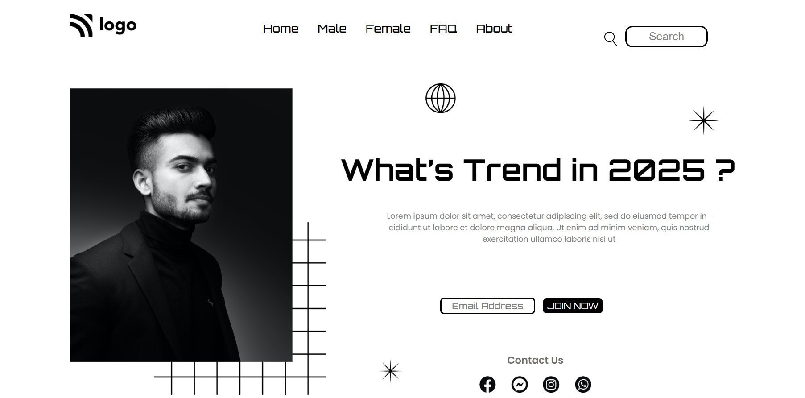

# Mohan Chindam

- From this Project, I have learned most about positions, how to use them, and where to use them.
- Learned how to target a particular element in a refined manner.
- Worked on images a lot and how to resize them according to requirements.
- Gave hovering effect to navigation bar options instead of just a static effect on the home option.
- This Project helps me polish my existing CSS & HTML skill. I enjoyed a lot building this Project.
- I have spent nearly 3:30hrs completing this Project. I started building with the navigation bar part and later the remaining parts.
- Just having trial and error problems in positioning or resizing elements, will solve them through practice.

- Below image shows the preview of Project

Project is deployed on **Netlify**:
- You can preview Project here, [**Street Style Landing Page**](https://street-style-landing-page-1.netlify.app/)

